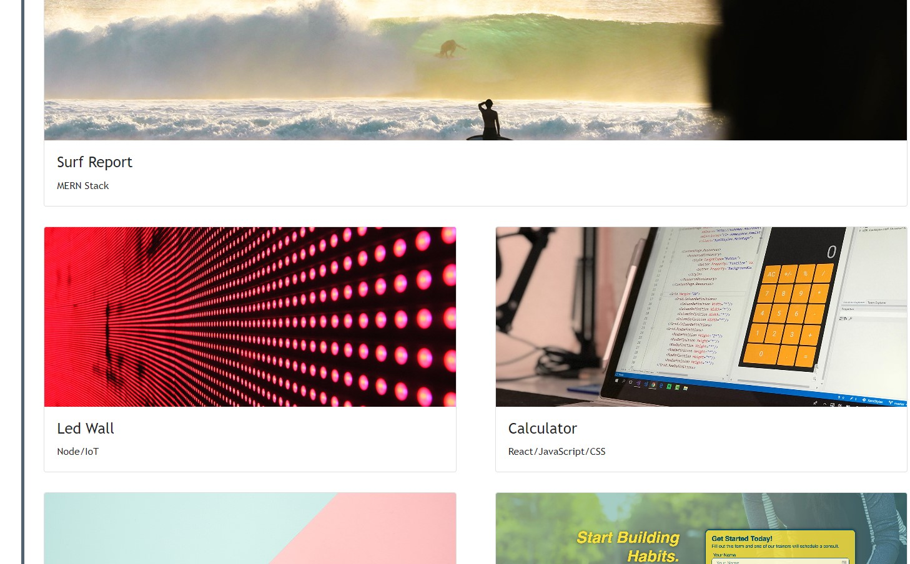
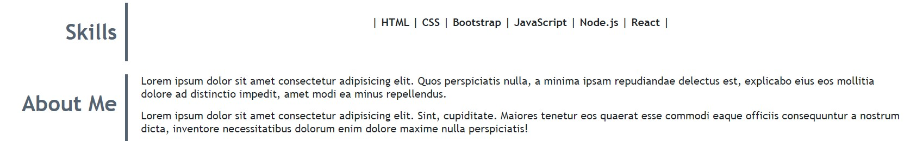

# Bootstrap-Portfolio

Alexandra Ionescu's Portfolio using Bootstrap

## Description

This Portfolio was created based on a previous Portfolio. The difference between them is that the first one was styled using CSS and this one was styled using both CSS and Bootstrap.

## Instalation

The website page can be accessed [here](https://ionescuea.github.io/Bootstrap-Portfolio/)

## Usage

The top of the page has a navigation bar that contains four links. The links navigate to relevant sections on the same page except the forth one wich opens a new page to a resume.

The hero section, created with Bootstrap jumbotron, displays the name and the photo.

The work section was created using Bootstrap cards. There is no work available to show, yet, however the cards can be modified and they have already been created as links and they can be easily updated.

The page has also a skills and about me sections that can be updated later on.

The footer contains the 'Contact me' section. All the links are active with a hover and box shadow effects.

## Credits

[BootcampSpot](https://github.com/edx)

[Alexandra Ionescu](https://github.com/ionescuea)

## License

Licensed under the [MIT](LICENSE) license.